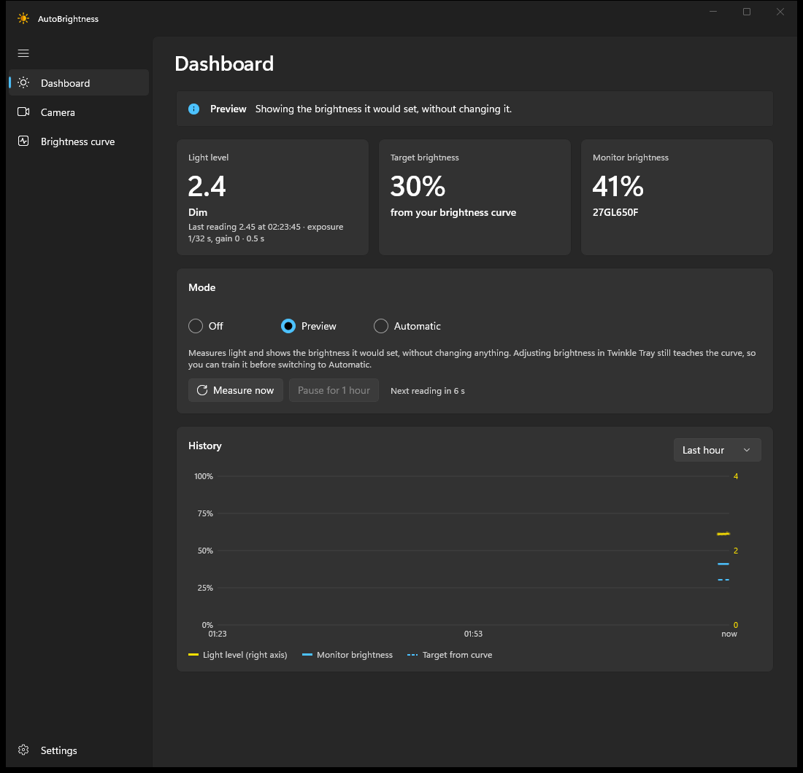
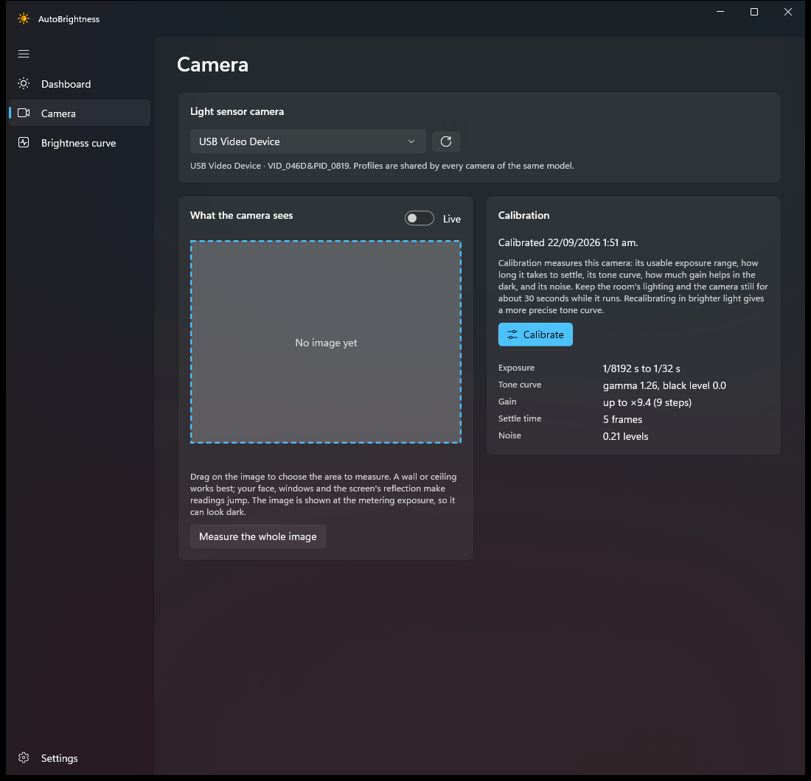
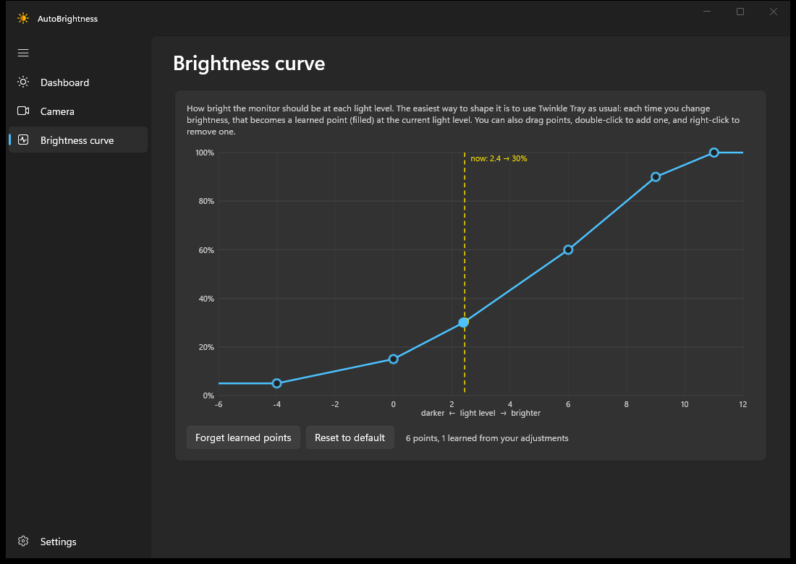

# AutoBrightness

Automatic monitor brightness for Windows desktops, using a webcam as the light sensor and
[Twinkle Tray](https://twinkletray.com/) to set brightness.

Most webcam-brightness tools average the picture while the camera's auto-exposure is on. Auto-exposure
keeps the picture at roughly the same brightness, so those readings barely change. AutoBrightness locks
the camera's exposure, gain and white balance. It measures each camera model's tone curve with a
calibration run and converts the picture into a light level that stays the same at any exposure setting.



| Camera and calibration | Brightness curve |
|---|---|
|  |  |

## Download

Get the zip for your PC from [Releases](https://github.com/g8row/autobrightness-win/releases): `win-x64` for most PCs, `win-arm64` for Windows on ARM. Unzip it anywhere and run `AutoBrightness.exe`; nothing needs installing.

Each release is built from its tag by [GitHub Actions](.github/workflows/release.yml) and carries a signed
[build provenance attestation](https://docs.github.com/actions/security-for-github-actions/using-artifact-attestations).
To check that a zip really came from this repository's workflow:

```
gh attestation verify AutoBrightness-0.1.0-win-x64.zip --repo g8row/autobrightness-win
```

SHA-256 checksums are in each release's `SHA256SUMS.txt`. The executable isn't code-signed, so SmartScreen may warn the first time you run it.

## How it works

1. **Measure:** about every 20 s, the camera opens for about half a second at 160×120. Exposure is
   locked and moved in steps (gain is used when it's too dark) until the chosen area is well exposed. The
   camera's own settings are restored afterwards.
2. **Smooth:** a median filter ignores one-off changes, such as someone walking past. The reading reacts
   faster when the room gets brighter than when it gets darker.
3. **Map:** an editable curve turns light level into brightness. When you change brightness in Twinkle
   Tray yourself, that becomes a learned point on the curve.
4. **Apply (Automatic mode):** the new brightness goes to Twinkle Tray over its local pipe
   (`\\.\pipe\twinkle-tray\cmds`) as a single step. Changes are deliberately rare: at least 10%, at most every
   15 minutes and 48 per day, because many monitors wear out their settings memory after about 100k writes.
   Changes of 30% or more, such as switching on the room lights, apply straight away. An optional fade is in Settings.

Modes: **Off** · **Preview** (measures, shows the target and learns, but never changes brightness) ·
**Automatic**. New installs start in Preview.

## Requirements

- Windows 10 2004 or later (developed on Windows 11)
- A USB webcam that allows manual exposure. Virtual cameras such as Camo or OBS can't be used.
- Twinkle Tray, running

## Building

```
dotnet build AutoBrightness.slnx
dotnet test --project tests/AutoBrightness.Core.Tests
```

This needs the .NET 10 SDK; Visual Studio is optional. The app is unpackaged and self-contained with
respect to the Windows App SDK.

Run `src/AutoBrightness.App/bin/Debug/net10.0-windows10.0.26100.0/win-x64/AutoBrightness.exe`.
Command-line switches:

- `--background`: start in the tray without showing the window (used by *Start with Windows*)
- `--exit`: ask the running instance to shut down cleanly

Set `AUTOBRIGHTNESS_DATA` to use a different data folder (portable use, or a second copy for testing).

To release, push a tag such as `v0.2.0`; the release workflow tests, builds both architectures, attests and publishes.

## Layout

| Path | What it is |
|---|---|
| `src/AutoBrightness.Core` | Camera metering, calibration, crash recovery, Twinkle Tray client, control loop, settings (no UI) |
| `src/AutoBrightness.App` | WinUI 3 tray app: dashboard, camera and calibration page, curve editor, settings |
| `tests/AutoBrightness.Core.Tests` | Unit tests, including a simulated camera |
| `tools/abctl` | Camera-only command-line diagnostics: `cameras`, `calibrate`, `measure`, `frames`, `startup`, `simulate-crash`, `recover` |
| `spikes/CameraProbe` | The first exploration spike (uses DirectShow; kept for reference) |
| `docs/` | [Research](docs/research.md) and [hardware findings](docs/camera-probe-findings.md) |

Settings, camera profiles and state are stored in `%LOCALAPPDATA%\AutoBrightness`.
